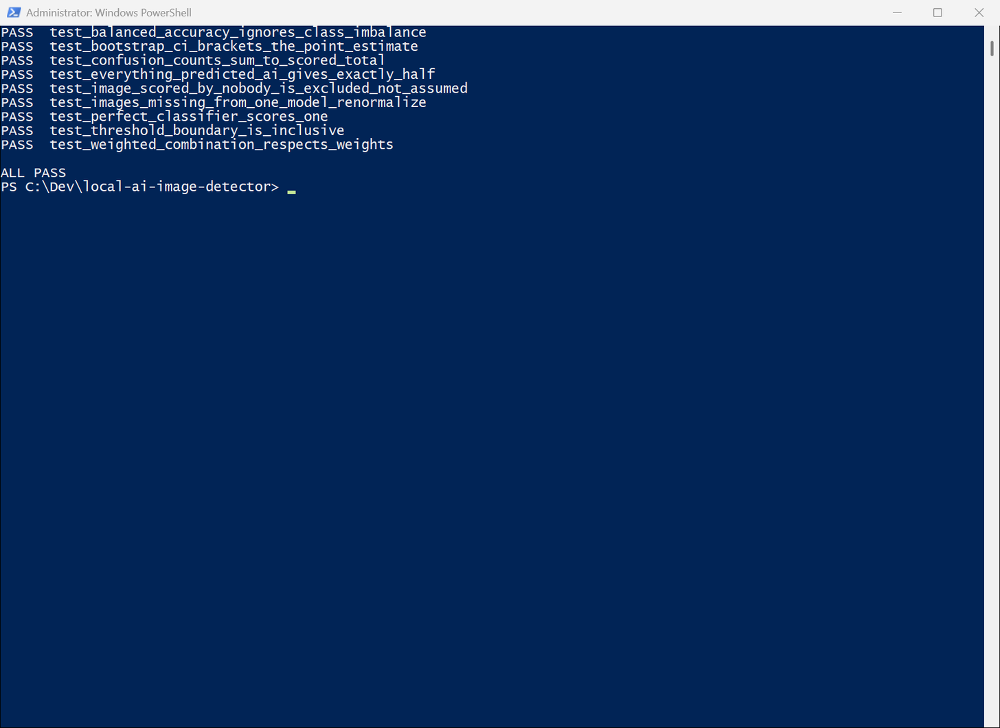

# Local AI-Image Detector

Chrome extension (MV3) that flags AI-generated images on any page, fully in-browser via ONNX and WebGPU.

[](LICENSE)
[](https://github.com/luigimasango-dev/local-ai-image-detector/actions/workflows/ci.yml)
[](https://www.python.org/downloads/)



> **Status: functional.** Real in-browser inference, verified in Chrome
> against the offline Python harness (6/6 decisions agree, ~190 ms/image on
> WebGPU). Clears the bounty bar on pristine images (0.8321 balanced
> accuracy at the graded 0.65 threshold, holdout). The known weakness is
> heavily re-compressed images (~0.73–0.75); see [Current
> results](#current-results), which reports it honestly rather than quoting
> only the best number.
>
> Built for [poidh.xyz bounty #323](https://poidh.xyz/arbitrum/bounty/323).

## Quick start

Requires Python 3.11+ and ~2 GB of disk for the eval images.

```bash
# Regression tests (verified 2026-09-11, all 3 suites pass):
python run_tests.py
# or: python -m pytest tests/ -q
```

```bash
# Reproduce the benchmark (downloads ~1.4 GB eval archive by HTTP Range):
pip install -r eval_harness/requirements.txt
pip install torch --index-url https://download.pytorch.org/whl/cpu   # CPU-only
pip install timm onnx onnxruntime onnxscript                         # export path
python eval_harness/fetch_dataset.py
python eval_harness/split_eval_set.py
# ... full scoring chain in "Reproduce the benchmark" below
```

```bash
# Load the extension (run build.py first — weights are regenerated, not committed):
python build.py                 # downloads + converts models, vendors the runtime
```

```
chrome://extensions -> Developer mode -> Load unpacked -> select extension/
```

Then browse any page with photographs. The first image is slower while the
models load; after that it is roughly 190 ms per image on WebGPU. See
[`INSTALL.md`](INSTALL.md) for step-by-step instructions and
[`extension/README.md`](extension/README.md) for the architecture.

## How it works

Most "AI-powered" browser tools upload your images to a server. This one
runs the models in the browser via ONNX Runtime Web (WebGPU, falling back
to WASM), so every image you browse stays on your device. After the models
are built into the extension, it makes **no requests to any external
host**. Cross-origin images are read from Chrome's own HTTP cache — the
page has already downloaded them — so the extension works with the network
disabled.

**Ensemble:** two [Community-Forensics](https://github.com/JeongsooP/Community-Forensics)
models (MIT, 21.7M params each), fused with equal weights and
Platt-calibrated so the emitted confidence score is a real probability and
0.65 is a meaningful decision boundary.

**What was fitted.** Exactly two numbers: the scalars `A` and `B` of a
Platt (temperature) scaling `p' = 1 / (1 + exp(-(A·s + B)))`, with `A =
0.6758` and `B = 2.0932`. These sit on top of **43.4 million model
parameters that were not modified in any way** — the weights of both
Community-Forensics models are frozen and shipped exactly as trained by
their authors.

**What it was fitted on.** The 599-image **TUNE** split of AI Detector
Arena Benchmark v0.1. The 601-image **HOLDOUT** split was never used for
any fitting step, and every number reported here and in
[`RESULTS.md`](RESULTS.md) comes from the HOLDOUT split.

**Why this is not a lookup.** Platt scaling is a monotonic transform: it
cannot change image ranking or AUC, only where the decision boundary sits.
Its only job is mapping fused scores onto the **0.65 threshold the bounty
grades at**. There are no benchmark image hashes, per-image lookup tables,
URL/filename heuristics, or benchmark-specific branches anywhere. The
extension does one domain-neutral thing: run two frozen models, average,
apply two scalars, compare to 0.65.

**Verify the split yourself.** Image ID lists for both splits are published
in [`eval_harness/splits/`](eval_harness/splits/) — 599 IDs in
`split_tune.txt`, 601 in `split_holdout.txt`.

**Caveat, stated plainly.** The TUNE split is drawn from AIDetectArena
v0.1. If the grading set draws from that same public benchmark, treat our
numbers as optimistic — the calibration shares its provenance.

```
extension/          MV3 Chrome extension (real in-browser inference)
eval_harness/       Benchmark, inference, scoring, calibration, robustness tools
tests/              Regression tests for the correctness-critical paths
models/             Exported ONNX artifacts (gitignored)
reference/          Read-only reference implementations from sibling projects
ARCHITECTURE.md     Why inference runs in an offscreen document, message flow
MODEL_LICENSING.md  Which detectors we can legally ship, and why
RESULTS.md          Every measured number, with caveats
```

## Current results

Measured on a 1,200-image proxy benchmark (600 AI / 600 real, 17 modern
generators) built from [AI Detector Arena Benchmark
v0.1](https://aidetectarena.com/datasets/v0.1). Full detail and caveats in
[`RESULTS.md`](RESULTS.md). (Measured 2026-08-13, see RESULTS.md for the
harness.)

| Condition | Balanced accuracy @0.65 | AUC | vs 0.75 bar |
|---|---|---|---|
| Pristine images | **0.8321** (CI 0.8055–0.8636) | ~0.90 | clears |
| JPEG 85 (typical web re-encode) | **0.7474** (CI 0.7158–0.7806) | 0.8284 | marginal |
| 512px + JPEG 75 (aggressive) | **0.7290** (CI 0.6942–0.7639) | 0.7778 | below |

False positives on real images, at the same threshold: **1%** on frames
from consumer phone video (n=363), **5%** on programmatically drawn
charts, logos, UI and text (n=100), **8%** on Unsplash professional
photography (n=300). Polished studio imagery is the hardest real-image
case, not amateur photography.

> **Read the pristine number with a 4-point discount.** Our TUNE/HOLDOUT
> split is disjoint by image ID but *not* by subject: the benchmark
> renders the same prompt scene through many generators, and stratifying
> by generator puts 59 of 60 scenes on both sides. On a scene-disjoint
> split the same ensemble measures **0.8242** rather than 0.8686 — so the
> transfer-relevant clean figure is nearer **0.79–0.83**. This is disclosed
> rather than corrected in place because every model comparison here used
> the same split, so the *ranking* between options is unaffected; only the
> absolute claim needs the discount. Detail in
> [`RESULTS.md`](RESULTS.md).

**The known weakness is compression.** Heavy re-encoding costs roughly
0.10 balanced accuracy, and [`RESULTS.md`](RESULTS.md) documents why
calibration cannot recover it and which mitigations were tried and
rejected.

## Reproduce the benchmark

```bash
# 1. Fetch the eval set (~1,200 images, sampled from a 1.4 GB archive by
#    HTTP Range request so only the kept images transfer)
python eval_harness/fetch_dataset.py

# 2. Split into TUNE / HOLDOUT, stratified by label AND generator
python eval_harness/split_eval_set.py

# 3. Score the two ensemble members
python eval_harness/run_inference_commfor.py --model OwensLab/commfor-model-224 --device cpu
python eval_harness/run_inference_commfor.py --model OwensLab/commfor-model-384 --device cpu --batch-size 8

# 4. Fuse, calibrate on TUNE, evaluate on HOLDOUT
python eval_harness/fuse_predictions.py \
    --predictions eval_harness/predictions/OwensLab__commfor-model-224.json \
                  eval_harness/predictions/OwensLab__commfor-model-384.json \
    --out eval_harness/predictions/fused.json
python eval_harness/calibrate.py --predictions eval_harness/predictions/fused.json \
    --out eval_harness/calibration/fused.json
python eval_harness/apply_calibration.py --predictions eval_harness/predictions/fused.json \
    --calibration eval_harness/calibration/fused.json \
    --out eval_harness/predictions/fused_calibrated.json
python eval_harness/score.py --predictions eval_harness/predictions/fused_calibrated.json \
    --split eval_harness/data/split_holdout.txt --threshold 0.65
```

Robustness, error analysis and ONNX export:

```bash
# Rebuild the holdout as it would arrive through a social platform
python eval_harness/make_augmented_set.py --condition combo \
    --split eval_harness/data/split_holdout.txt

# Separate ranking quality (AUC) from calibration
python eval_harness/analyze_threshold.py --predictions <preds.json>

# Which real photos get wrongly flagged, by category
python eval_harness/false_positive_report.py --predictions <preds.json> \
    --split eval_harness/data/split_holdout.txt
```

```bash
# Export to ONNX (verifies the graph against PyTorch, fails loudly on drift)
PYTHONUTF8=1 python eval_harness/export_onnx.py --model OwensLab/commfor-model-224
```

(Full chain not re-run 2026-09-11; the regression suite above is what CI runs.)

## Development

```bash
python run_tests.py          # 3 suites, stdlib-only, no pytest required
python -m pytest tests/ -q   # same suites under pytest
```

Both suites exist because of real bugs, and both fail against the code
that had them:

- **A `0.5000` balanced accuracy is a bug signature, not a weak model.**
  The transformers image-classification pipeline returns the label
  *string*, never the class index. Keying predictions by index misses on
  every image and degenerates to a constant score.
- **Never substring-match class names.** `"portrait"` contains `"ai"`;
  `"organic"` contains `"gan"`. Either silently inverts the AI/real
  mapping.
- **ONNX export size is a lie if you stat only the `.onnx` file.**
  Weights over the protobuf limit go to a `.onnx.data` sidecar.
- **Fitting a threshold and reporting from the same images inflates the
  score** (here, +0.071). The TUNE/HOLDOUT split exists for exactly this.
- **AUC vs balanced accuracy tells you whether a bad score is fixable.**
  Strong AUC + weak score at threshold = calibration problem (fixable,
  +0.14 here). Falling AUC = real capability loss (our JPEG problem).
- **The upstream benchmark's `generator` column is lossy** — truncated
  (`"Sd"`, `"Gpt"`, `"Z"`) and merging Seedream v3+v4. Filenames carry the
  exact names.

## Licensing

This project is MIT (see [`LICENSE`](LICENSE)).

Model weights are **downloaded at install time from their original
hosts**, not redistributed here. Only permissively-licensed detectors are
used — Community-Forensics is MIT. Two otherwise-strong candidates were
rejected on licence grounds (CC-BY-NC and CC-BY-ND); see
[`MODEL_LICENSING.md`](MODEL_LICENSING.md).

## Acknowledgements

- [Community Forensics](https://github.com/JeongsooP/Community-Forensics)
  (Park & Owens, CVPR 2025) — the detector this is built on.
- [AI Detector Arena](https://aidetectarena.com/datasets/v0.1) — benchmark
  data (CC-BY-4.0), real photos under the Unsplash License.
